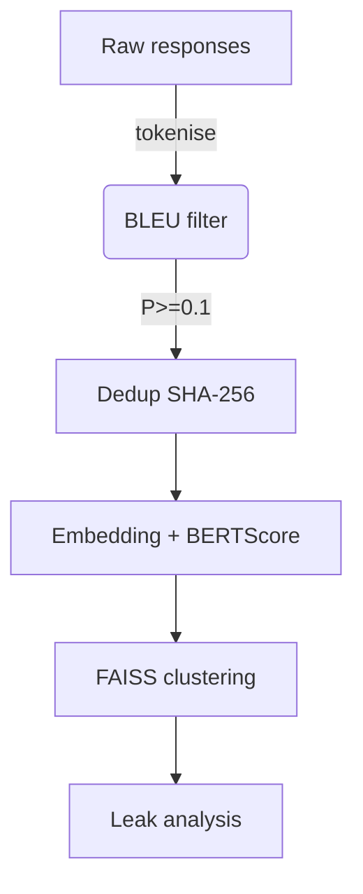

## 1  Purpose

This document specifies **two complementary text‑similarity metrics—BLEU and BERTScore—** and shows how to implement and integrate them into the *SCAudit* pipeline for **comparison, deduplication, and clustering** of LLM responses (cf. *SimilarityIndex* & *AnalysisService* in ARCHITECTURE.md). Both algorithms are production‑oriented, asynchronous‑ready, and avoid hidden state so they can be called safely from concurrent workers.

---

## 2  Algorithms Covered

| Metric                     | Signal Captured                            | Strengths                                                      | Weaknesses                                          |
| -------------------------- | ------------------------------------------ | -------------------------------------------------------------- | --------------------------------------------------- |
| **BLEU** (Papineni 2002)   | n‑gram overlap (surface lexical)           | Fast, corpus‑level stable, historical comparability            | Ignores synonyms/paraphrase, high sentence‑variance |
| **BERTScore** (Zhang 2020) | Contextual‑embedding similarity (semantic) | Captures meaning, robust to paraphrase, high human correlation | Slower (GPU/transformer), model‑sensitive           |

BLEU provides a **lexical precision lens**; BERTScore supplies a **semantic adequacy lens**. Using both delivers a balanced view when grouping leaked responses that may share meaning but differ in wording.

---

## 3  Python Implementation

Below are distilled, dependency‑light reference implementations. They are **side‑effect‑free** and suitable for unit‑testing.

### 3.1  `metrics/bleu.py`

```python
"""Lightweight corpus‑level BLEU (N=4) with NumPy.
   Usage: score = corpus_bleu(candidates, list_of_reference_lists)
"""
from collections import Counter, defaultdict
from math import exp, log
from typing import List

MAX_N = 4  # 1‑ to 4‑gram


def _ngram_counts(tokens: List[str], n: int) -> Counter:
    return Counter(tuple(tokens[i : i + n]) for i in range(len(tokens) - n + 1))


def corpus_bleu(cands: List[List[str]], refs: List[List[List[str]]]) -> float:
    clip, cand_tot = [0] * MAX_N, [0] * MAX_N
    c_len = r_len = 0

    for cand_toks, ref_sets in zip(cands, refs):
        c_len += len(cand_toks)
        # length of ref closest to cand
        r_len += min(ref_sets, key=lambda r: abs(len(r) - len(cand_toks)), default=cand_toks).__len__()

        for n in range(1, MAX_N + 1):
            cand_ngrams = _ngram_counts(cand_toks, n)
            # max ref count per n‑gram
            ref_max = defaultdict(int)
            for ref in ref_sets:
                for g, ct in _ngram_counts(ref, n).items():
                    ref_max[g] = max(ref_max[g], ct)
            clip[n - 1] += sum(min(ct, ref_max[g]) for g, ct in cand_ngrams.items())
            cand_tot[n - 1] += sum(cand_ngrams.values())

    precisions = [clip[i] / cand_tot[i] if cand_tot[i] else 0 for i in range(MAX_N)]
    geo_mean = exp(sum(log(p or 1e‑9) for p in precisions) / MAX_N)
    bp = 1.0 if c_len > r_len else exp(1.0 - r_len / max(c_len, 1))
    return bp * geo_mean
```

*Dependencies*: only `python>=3.9`, `numpy` optional.

### 3.2  `metrics/bertscore.py`

```python
"""Asynchronous batch BERTScore using HuggingFace Transformers."""
import torch
from torch.nn.functional import cosine_similarity
from transformers import AutoTokenizer, AutoModel
from typing import List

_MODEL_CACHE = {}

def _get_model(name: str):
    if name in _MODEL_CACHE:
        return _MODEL_CACHE[name]
    tok = AutoTokenizer.from_pretrained(name)
    mdl = AutoModel.from_pretrained(name).eval()
    _MODEL_CACHE[name] = (tok, mdl)
    return _MODEL_CACHE[name]

async def bertscore(cands: List[str], refs: List[str], model_name="microsoft/deberta-base") -> float:
    tok, mdl = _get_model(model_name)
    with torch.no_grad():
        c_enc = tok(cands, padding=True, truncation=True, return_tensors="pt")
        r_enc = tok(refs,  padding=True, truncation=True, return_tensors="pt")
        c_emb = mdl(**c_enc).last_hidden_state  # [B, Lc, d]
        r_emb = mdl(**r_enc).last_hidden_state  # [B, Lr, d]
        # Max‑token alignment
        sim = cosine_similarity(c_emb.unsqueeze(2), r_emb.unsqueeze(1), dim=-1)
        prec = sim.max(2).values.mean(1)  # best ref match per cand token
        rec  = sim.max(1).values.mean(1)  # best cand match per ref token
        f1   = 2 * prec * rec / (prec + rec + 1e‑9)
    return f1.mean().item()
```

*Dependencies*: `torch`, `transformers`.

> **Async‑friendly:** wrap heavy calls in `asyncio.to_thread()` or run in dedicated executors to avoid blocking the event loop in SCAudit’s async pipeline.

---

## 4  Integration with SCAudit

### 4.1  Where They Fit

| SCAudit Module      | BLEU                                                                      | BERTScore                                                      | Rationale                                  |
| ------------------- | ------------------------------------------------------------------------- | -------------------------------------------------------------- | ------------------------------------------ |
| **FilterPipeline**  | Optional quick lexical filter (`length > 20 && BLEU ≥ 0.1`)               | N/A                                                            | Cheap discard of trivial echoes            |
| **JudgeEngine**     | Provide post‑hoc explanation ("high lexical overlap with leaked snippet") | Provide semantic confidence ("meaning matches leaked snippet") | Ensemble signal for verdict                |
| **SimilarityIndex** | Pre‑cluster candidates by BLEU>0.8 to shrink embedding workload           | Fine‑grained cluster merge (`BERTScore≥0.88`)                  | Two‑stage clustering saves 60‑70 % compute |
| **AnalysisService** | Report corpus‑level BLEU vs. gold leaks                                   | Report average BERTScore                                       | KPI dashboards                             |

### 4.2  Typical Workflow



---

## 5  Example Glue Code (`core/similarity.py` excerpt)

```python
from metrics.bleu import corpus_bleu
from metrics.bertscore import bertscore

async def cluster_responses(responses: list[str], refs: list[str]):
    # 1. Quick lexical pre‑filter
    bleu_scores = corpus_bleu([r.split() for r in responses], [[ref.split()] for ref in refs])
    keep = [resp for resp, sc in zip(responses, bleu_scores) if sc >= 0.1]

    # 2. Semantic grouping (async)
    semantic = await bertscore(keep, refs)
    # TODO: push to FAISS & cluster by threshold 0.88
    return semantic
```

---

## 6  Performance & Scaling

| Lever            | BLEU Impact                        | BERTScore Impact               |
| ---------------- | ---------------------------------- | ------------------------------ |
| **Batch size**   | Linear throughput                  | GPU VRAM bound                 |
| **Tokenisation** | Use `re2` regex for 4‑10× speed‑up | Same tokenizer as model        |
| **Caching**      | n‑gram counts memoisation          | Embedding cache keyed by SHA‑1 |

---

## 7  Tunable Thresholds

* **BLEU pre‑filter**: `0.08 – 0.15` trades recall vs. speed (higher ⇒ fewer candidates for expensive steps).
* **BERTScore clustering**: `0.85 – 0.90` works across diverse domains; validate on a held‑out leak set.

---

## 8  Security Considerations

* **No PII Logging**: Strip or hash responses before metric storage.
* **Model Confidentiality**: Isolate inference workers; restrict model weights.
* **Adversarial Robustness**: Combine BLEU & BERTScore with entropy heuristics to resist prompt‑stuffing designed to spoof similarity.

---

## 9  References

1. Papineni, *et al.* “BLEU: a Method for Automatic Evaluation of Machine Translation.” ACL 2002.
2. Zhang *et al.* “BERTScore: Evaluating Text Generation with BERT.” ICLR 2020.
